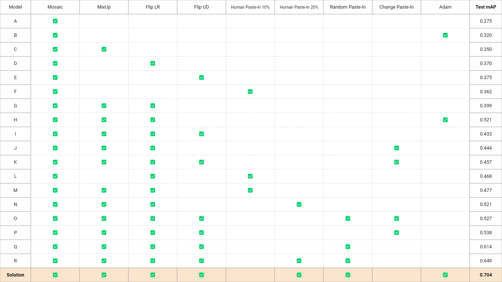

# 🛒FaindersAI | Object Detection In Retail🛒 
> ### 파인더스에이아이 기업연계 프로젝트
> ### 데이터 내의 correlation을 최소화하기 위한 training 전략

    
    
    

-------------------
## 🔥Member
| [정승윤](https://github.com/syoon6682) | [김주희](https://github.com/alias26) | [신현수](https://github.com/Hyun-soo-Shin) | [이우택](https://github.com/dldnxor) | [이해욱](https://github.com/woooo-k) |
| :-: | :-: | :-: | :-: | :-: |
|  |  |  |  |  |
-------------------
## 👨‍👩‍👧‍👧Team Roles
>- **이우택**  
>   - Data Augmentation 실험
>   - Change Paste-In 구현 및 개선
>   - Correlation Metric 개선
>   - 모델 학습 안정화
>- **정승윤**
>   - 팀장 및 발표
>   - 데이터 Stratify 샘플링 코드 구현
>   - Correlation Metric 제시
>   - Custom CV 데이터 생성 로직 구현
>   - Change Paste In ratio 개선
>- **김주희**  
>   - Custom CV 데이터 생성 로직 구현
>   - Streamlit을 이용한 Annotation 툴 구현
>   - Change Paste-In 구현 및 개선
>   - Correlation Metric 재선정 및 개선 방향 제시
>   - Custom CV Data 실험 및 검증
>- **이해욱**  
>   - 여러 Optimizer, Scheduler 추가 후 실험
>   - Albumentation Distortion 외 기타 Augmentation 실험
>   - Batch size 등 Hyperparameter Tuning
>   - Correlation Metric 개선 방향 제안
>   - 다양한 Correlation Metric Visualization
>- **신현수**  
>   - Dataset EDA 및 Visualization
>   - Albumentation Augmentation 적용 구현
>   - Random Paste-In 및 Change Paste In 구현 및 개선
>   - Yolov7 학습 안정화
>   - Correlation Metric 개선 방향 제안

-------------------
## 🗃️Procedures

-------------------

## 1. 프로젝트 배경 및 문제 정의 

 

## 2. 모델 선정 및 실험 설정

### 2-1. Dataset 정보

**Train Set & Validation Set**

- 데이터 수집 및 라벨링 난이도 등으로 인해 그룹별로 상품을 나누어 데이터 생성
    
    → 이미지당 한 그룹의 상품으로 구성
    

**Test Set**

- 그룹과 상관없이 여러 상품이 모두 등장 할 수 있는 환경
    
    → 이미지당 여러 그룹의 상품들로 구성
    

### 2-2. 모델선정

**YOLOv7-X 선정**

- 무인 매장에서 활용하는 모델이므로 실시간 탐지에 적합한 **One-Stage 계열 모델** 선정
- **Test mAP**와 **학습시간** 고려

### 2-3. 실험 설정

- 절반의 데이터를 그룹에 대해 **Stratify**하게 샘플링
- Metric : Test mAP
- Sub Metric : sameFP(같은 그룹의 상품으로 오탐), diffFP(다른 그룹의 상품으로 오탐)
- Epoch : 50
- Inference 시 Confidence-Threshold = **0.25**, IoU-Threshold = **0.45**를 사용(Yolo detect default 값)
- Train, Test Image Size = 640 x 640

 

## 3. 실험 선정 및 결과 분석
### 3-1. Human Paste-In

**개요 :** 랜덤한 **Object와 사람**을 새로운 Background에 붙여넣어 **새로운 이미지 데이터 생성**, 기존 학습 데이터셋에 **추가**

**기대효과** : 하나의 이미지에 여러 그룹의 데이터가 존재하도록 하여, **상품과 상품** 간의 Correlation과 **상품과 Background** 간의 Correlation을 줄임

| 기존 이미지 | HPI 적용결과 | 
| :-: | :-: | 
|  |  |

| Streamlit 검수 활용 예시| 
| :-: |
|  | 

**실험 결과**

Base : 데이터 22100장, Mosaic+MixUp+Fliplr
HPI[이미지수]: 추가된 Human Paste-In 데이터 수

1차 데이터 제작 : 4839장
2차 데이터 제작 : 4848장

총 **9687장**의 데이터 제작 (기존 Train Dataset의 약 22%)
|     | Base | Base+HPI[2400] | Base+HPI[4800] |
| :-: | :-: | :-: | :-: |
|**Test mAP**| **0.399** | **0.477** | **0.521** |
|Valid mAP| 0.934 | 0.932 | 0.936 |
| sameFP | 2250 | 2207 | 1967 |
| diffFP | 84 | 162 | 106 |

### 3-2. Random Paste-In
- **개요 :** 배경 이미지에 **랜덤한 위치**에 **랜덤한 상품**을 붙여 넣는 방식
- **기대 효과 : 상품과 상품**간의 Correlation, **상품과 사람**간의 Correlation, **상품과 Background**간의 Correlation을 모두 해결

| 기존 이미지 | RPI 적용결과 | 
| :-: | :-: | 
|  |  |

|     |Base | +Random Paste-In |
| :-: | :-: | :-: |
|**Test mAP**| **0.399** | **0.556** |
|Valid mAP| 0.934 | 0.928 | 
| sameFP | 2250 | 2402 |
| diffFP | 84 | 137 |

### 3-3. Change Paste-In
- **개요:** 배경 이미지의 상품이 존재하는 자리에 다른 그룹의 상품을 덮어씌우는 방법
- **기대 효과 : 상품과 상품**간의 Correlation과 **상품과 사람**간의 Correlation을 모두 해결

| 기존 이미지 | CPI 적용결과 | 
| :-: | :-: | 
|  |  |

|     | Base | +Change Paste-In |
| :-: | :-: | :-: |
|**Test mAP**| **0.399** | **0.444** |
|Valid mAP| 0.934 | 0.922 | 
| sameFP | 2250 | 2149 |
| diffFP | 84 | 98 |

 

## 4. Conclusion
### 4-1. Ablation Study

### 4-2 결과
Full Data는 그룹 별 데이터 수의 Imbalance를 방지하기 위해 Stratify하게 추출하여 활용함 

**Our Solution :** <U>Human Paste-In(9687) + Adam + Mosaic(1.0) + FlipLR(0.5) + FlipUD(0.5) + Random Paste-In(0.75)</U>

|     | Mosaic | Our Solution |
| :-: | :-: | :-: |
|**Test mAP**| **0.442** | **0.727** |
|Valid mAP| 0.946 | 0.946 | 
| sameFP | 1505 | 1032 |
| diffFP | 19 | 175 |

### 4-3. 후속 개발 및 연구

1. **느린 학습 속도 개선**
    - Paste-In을 활용하는 과정에서 Paste할 Sample들을 Load하는데 시간이 소요됨
    - Sample을 Load하는 과정을 간략화 하여 학습 소요 시간 개선
2. **부자연스러운 Paste-In 개선**
    - Paste-In을 활용할 때 Paste되는 BBox의 배경이 함께 붙여지기 때문에 이미지가 부자연스러워짐
    - Paste되는 객체의 배경을 지우는 작업 필요
3. **모델 구조 변경을 통한 Correlation 문제 해결**
    - 학습 시 Receptive Field의 크기를 줄이는 등, 모델의 Architecture 수정을 통한 Correlation 문제 해결
4. **Optimizer와 Correlation 문제 해결의 관계성 연구**
    - SGD보다 Adam을 활용할 시 Test mAP 및 그 외 Metric까지 모두 향상
    - 이런 향상에 대한 명확한 근거에 대한 연구 필요
5. **Human Paste-In의 Dataloader에서의 자동화**
    - 현 방식의 Human Paste-In은 사람이 직접 생성된 데이터를 검수해야함
    - Human Paste-In을 검수 없이 Dataloader에서 불러올 수 있도록 자동화
